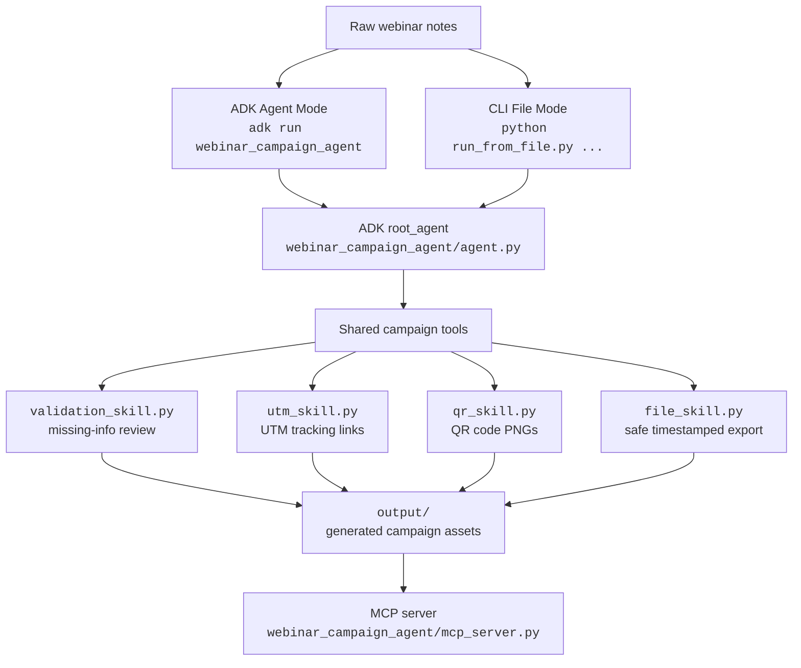

# Webinar Campaign Forge Agent

Built as the capstone project for Kaggle's 5-Day AI Agents Intensive with Google.

### Overview

Webinar Campaign Forge Agent turns rough webinar notes into campaign-ready assets for local marketing workflows. It supports full campaign generation, single-channel generation, missing-info validation, UTM tracking links, QR codes, and safe timestamped local file export.

The project can run through the Google ADK agent interface or through a normal CLI file workflow. Both modes reuse the same underlying campaign tools.

## Two Ways to Run

### 1. ADK Agent Mode

Use this mode to demonstrate the Kaggle 5-Day AI Agents / Google ADK capstone requirement. It exposes the ADK `root_agent` and tool-calling agent interface.

```bash
adk run webinar_campaign_agent
```

### 2. CLI File Mode

Use this mode for a practical local workflow from a notes file. It reads `input/raw_webinar_notes.txt` and writes generated files to `output/`.

```bash
python run_from_file.py review
python run_from_file.py linkedin
python run_from_file.py full
```

### Track

Agents for Business

### Problem

Marketing teams often spend hours converting webinar planning notes into publishable campaign materials. This creates delays, inconsistent messaging, and tracking mistakes.

### Solution

This project uses a Google ADK agent to read the user's requested output mode, extract structured webinar details, draft the requested campaign copy, generate relevant UTM links, create QR codes when needed, and save reusable campaign files into an output folder when the mode calls for it.

## Key Concepts Demonstrated

| Capstone Concept | Where Demonstrated |
|---|---|
| ADK Agent | `webinar_campaign_agent/agent.py` defines the `root_agent` |
| Tool use / agent skills | `review_webinar_notes`, `generate_utm_url`, `generate_qr_code`, `save_campaign_file` |
| MCP Server | `webinar_campaign_agent/mcp_server.py` exposes generated text assets |
| Antigravity | Demonstrated in the video as the development/review environment |
| Security features | Safe filenames, output directory restriction, URL validation, no committed secrets |
| Deployability | Reproducible local setup, CLI runner, and ADK Web demo |

## Architecture

The project can run in two modes. ADK mode demonstrates the agent implementation required by the course. CLI mode provides a practical local workflow where users place notes in an input file and generate only the assets they need.

```text
webinar-campaign-cli-agent
|-- webinar_campaign_agent
|   |-- agent.py              # ADK root_agent and instructions
|   |-- mcp_server.py         # MCP access to generated text assets
|   |-- __init__.py
|   `-- skills
|       |-- validation_skill.py
|       |-- utm_skill.py
|       |-- qr_skill.py
|       |-- file_skill.py
|       `-- __init__.py
|-- input
|   |-- raw_webinar_notes.txt # local CLI input file
|   `-- .gitkeep
|-- output                    # generated assets, ignored by Git
|-- samples
|   `-- raw_webinar_notes.txt
|-- run_from_file.py          # CLI File Mode
|-- requirements.txt
|-- .env.template
|-- .gitignore
|-- README.md
`-- LICENSE
```



| Component | Role |
|---|---|
| `root_agent` | Coordinates mode-aware campaign generation from rough webinar notes |
| `skills/` | Shared tool layer used by ADK mode and CLI mode |
| `run_from_file.py` | Practical local runner that sends `input/raw_webinar_notes.txt` to the same ADK agent |
| `output/` | Local ignored folder for generated campaign assets |
| MCP server | Lets MCP-compatible clients list and inspect generated text assets |

Generated file examples:

```text
output/
  landing_page_YYYYMMDD_HHMMSS.md
  email_draft_YYYYMMDD_HHMMSS.txt
  social_posts_YYYYMMDD_HHMMSS.md
  campaign_qr_YYYYMMDD_HHMMSS.png
```

## Output Modes

The agent reads the user's intent before generating assets. These same modes can be requested in ADK mode through prompts or in CLI mode through command arguments.

| User asks | Agent generates |
|---|---|
| Full campaign, everything, or all assets | Landing page, email, LinkedIn post, Facebook post, UTM links, QR code, saved files |
| Just LinkedIn | LinkedIn post, LinkedIn UTM link, LinkedIn share URL |
| Just Facebook | Facebook post, Facebook UTM link, Facebook share URL |
| Email only | Subject lines, preview text, plain-text email draft |
| Landing page only | Landing page copy |
| Social posts only | LinkedIn and Facebook posts, UTM/share links |
| QR code only | QR code from the registration URL |
| Review the campaign | Suggestions only, unless file generation is requested |

## Why This Is Agentic

The agent reads the requested output mode first instead of always generating every artifact. For LinkedIn-only requests, it generates only LinkedIn copy and tracking links. For full-campaign requests, it coordinates validation, copy generation, UTM link generation, QR creation, and safe file export.

## Campaign Validation

Review mode and normal generation use missing-info validation to identify gaps in the campaign brief. The agent uses placeholders instead of inventing missing facts, so incomplete notes remain visible during generation.

Example checklist:

```markdown
## Missing / Needs Review

- [ ] Speaker bio is missing
- [ ] Webinar platform is unclear
- [ ] CTA needs approval
```

## Setup

Clone the repository:

```bash
git clone https://github.com/halchemylab/webinar-campaign-cli-agent.git
cd webinar-campaign-cli-agent
```

Create and activate a virtual environment.

macOS/Linux:

```bash
python3 -m venv .venv
source .venv/bin/activate
```

Windows PowerShell:

```powershell
python -m venv .venv
. .\.venv\Scripts\Activate.ps1
```

Install dependencies:

```bash
pip install -r requirements.txt
```

Create a local environment file:

```bash
cp .env.template .env
```

Then edit `.env` and replace the placeholder with your Gemini API key:

```env
GOOGLE_API_KEY="YOUR_API_KEY"
```

## Run the Agent: ADK Agent Mode

Use this mode to run the project as an ADK agent for the capstone requirement.

```bash
adk run webinar_campaign_agent
```

Example prompt:

```text
Generate only a LinkedIn post from these webinar notes:

Topic: Using AI Agents to Improve Omnichannel Marketing Operations
Speaker: Jane Lee
Audience: Marketing managers
Date: July 24, 2026
Registration link: https://example.com/webinar
```

## Run From a Notes File: CLI File Mode

Use this mode to process notes from a local input file.

Create an input file:

macOS/Linux:

```bash
mkdir -p input
cp samples/raw_webinar_notes.txt input/raw_webinar_notes.txt
```

Windows PowerShell:

```powershell
New-Item -ItemType Directory -Force input
Copy-Item samples/raw_webinar_notes.txt input/raw_webinar_notes.txt
```

Then run the agent with a mode:

```bash
python run_from_file.py full
python run_from_file.py linkedin
python run_from_file.py facebook
python run_from_file.py email
python run_from_file.py social
python run_from_file.py landing
python run_from_file.py qr
python run_from_file.py review
```

For example:

```bash
python run_from_file.py linkedin
```

This generates only the LinkedIn post, LinkedIn tracking URL, and LinkedIn share URL.

Generated assets appear in:

```text
output/
```

## What Each Mode Is For

| Mode | Command | Best for |
|---|---|---|
| ADK | `adk run webinar_campaign_agent` | Proving the ADK agent requirement |
| CLI | `python run_from_file.py linkedin` | Fast practical generation |
| CLI review | `python run_from_file.py review` | Missing-info checklist |
| CLI full | `python run_from_file.py full` | Complete campaign package |

## Final Demo Commands

```bash
python run_from_file.py review
python run_from_file.py linkedin
python run_from_file.py full
adk run webinar_campaign_agent
```

Suggested demo positioning:

```text
I kept ADK as the agent interface because it maps directly to the course requirement, but I also added a CLI runner so the workflow is actually useful. Both modes reuse the same campaign tools for validation, UTM generation, QR code creation, and safe file export.
```

## Run the ADK Web Demo

```bash
adk web --port 8000
```

Open the local UI in your browser and select the webinar campaign agent.

ADK Web is used here as a local development and debugging demo interface. It is not a production deployment.

## Run the MCP Server

```bash
python -m webinar_campaign_agent.mcp_server
```

The MCP server exposes generated campaign assets through tools so another MCP-compatible client can list and inspect files in `output/`.

## Security Notes

These security features are local workflow protections for a capstone/demo project, not enterprise hardening.

- `.env` is ignored by Git.
- Generated campaign files are restricted to `output/`.
- Path traversal is blocked with safe filename handling.
- Only `.md`, `.txt`, and `.png` output files are allowed.
- UTM and QR code tools validate URLs before generating tracking links or QR codes.
- Generated filenames include a timestamp so campaign runs are easier to track.
- The project does not require committing API keys, passwords, or generated client assets.

## Demo Prompt

```text
Generate a full webinar campaign for this event:

Topic: Using AI Agents to Improve Omnichannel Marketing Operations
Speaker: Jane Lee, Director of Growth Marketing at ExampleCo.
Audience: Marketing managers, demand generation teams, and small business owners.
Date: July 24, 2026
Time: 11:00 AM Pacific
Platform: Zoom
Registration link: https://example.com/webinar

Core idea:
Teams waste hours turning event notes into landing pages, emails, social posts, tracking links, and QR codes.
```

## Example Prompts

### Full campaign

```text
Generate the full campaign from these webinar notes:
...
```

### LinkedIn only

```text
Generate only a LinkedIn post from these webinar notes:
...
```

### Facebook only

```text
Generate only a Facebook post from these webinar notes:
...
```

### Email only

```text
Generate an email draft only from these webinar notes:
...
```

### Social posts only

```text
Generate LinkedIn and Facebook posts only from these notes:
...
```

### QR code only

```text
Generate a QR code for this registration URL:
https://example.com/webinar
```

The key agent behavior is that it does not blindly generate every artifact. It reads the user's intent first. If you ask for only LinkedIn, it generates only LinkedIn copy and the LinkedIn tracking link. If you ask for the full campaign, it coordinates multiple tools to generate landing page copy, email, social posts, UTM links, QR code, and saved output files.

## Sample Input

The repository includes a sample notes file:

```text
samples/raw_webinar_notes.txt
```

Use it as the source material for local testing or demo recording.

## License

This project is licensed under the MIT License. See [LICENSE](LICENSE) for details.
